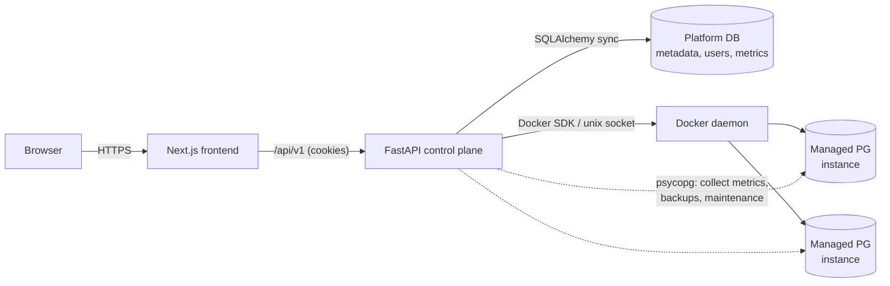
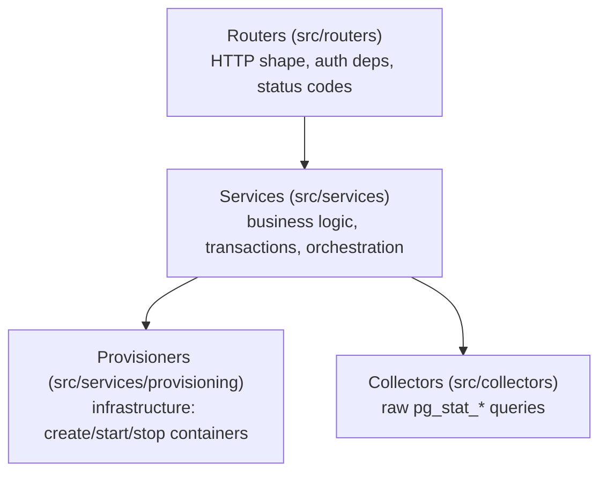
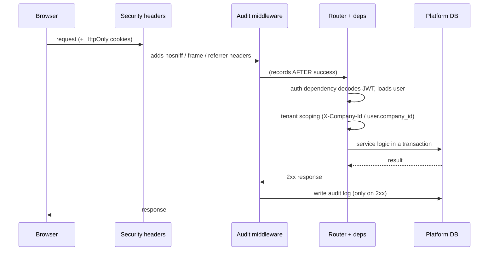
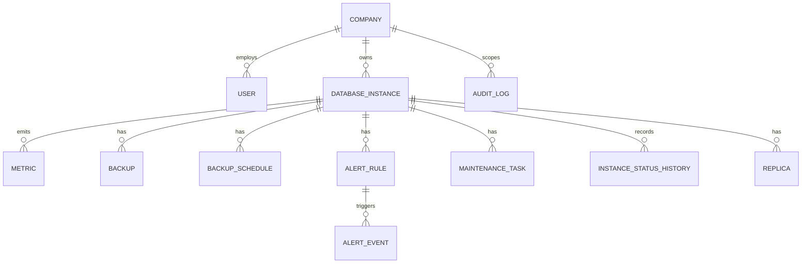
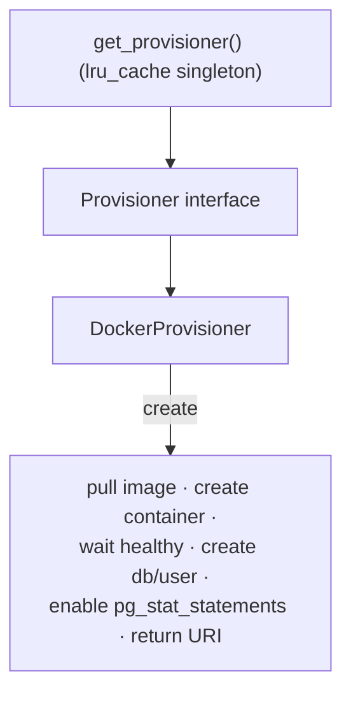

# Architecture

This document explains **how the platform is built and why** — the moving parts,
the boundaries between them, and the design decisions behind them. For *what* the
product does and how to run it, see the [README](README.md).

- **Backend** — Python 3.12 · FastAPI · SQLAlchemy 2 (sync) · Alembic · PostgreSQL 16
- **Frontend** — Next.js (App Router) · TypeScript · Tailwind · next-intl
- **Runtime** — Docker Compose; instances are provisioned as **real PostgreSQL containers**

---

## 1. System context

The control plane (this app) manages a fleet of managed PostgreSQL databases. The
browser talks only to the frontend and the API; the API is the only component that
talks to the Docker daemon and to the managed databases.



The distinction that matters: **the platform database** (one Postgres holding all
control-plane metadata — users, instances, metrics, backups, audit) is separate
from the **managed databases** (the containers the platform creates). The API
connects to managed databases only to do work on them (collect stats, run
`pg_dump`, `VACUUM`, etc.); their connection URIs are stored **encrypted** in the
platform DB.

---

## 2. Layered backend

A single, strictly enforced rule keeps the backend legible at ~10k lines:

> **Routers → Services → Provisioners.** A layer may call the layer below it,
> never above, and never skip a layer.



- **Routers** own the HTTP contract: request/response schemas (Pydantic v2),
  dependency-injected auth and tenant scoping, and status codes. They contain no
  business logic.
- **Services** own the logic and the database transaction boundary. They compose
  provisioners, collectors and models; they are what the tests exercise most.
- **Provisioners** own *infrastructure*. The `Provisioner` interface abstracts
  "make a database exist" so the Docker implementation can be swapped for a cloud
  backend without touching services (see §6).

**Why this matters:** the layering is the single most load-bearing decision in the
codebase. It is what lets a reader open any router and know exactly where the logic
lives, and what makes the provisioning backend replaceable.

---

## 3. Request lifecycle

Every request passes through a deliberate middleware chain and a dependency stack:



- **Auth** is a FastAPI dependency: it reads the JWT from an **HttpOnly cookie**
  (not JS-readable), validates it, checks the token blacklist, and yields the
  current `User`. Refresh is a separate rotating-token endpoint.
- **Tenant scoping** resolves the active company (a superuser's `X-Company-Id`
  header, or a regular user's own `company_id`) and is threaded into every query.
- **Audit middleware is added last** so it runs innermost — it records an action
  **only after** the handler returns 2xx, mapping method+path to a semantic action
  (`instance_created`, `backup_created`, …) without ever reading the request body.

---

## 4. Background workers

Eight long-running loops are started in the FastAPI **lifespan** and stopped
gracefully on shutdown (each has its own `asyncio.Event`; shutdown sets them all
and awaits the tasks so no DB commit is torn mid-flight):

| Worker | Interval | Responsibility |
|---|---|---|
| Status poller | ~10s | Reconcile container state → `instance_status_history` (drives uptime) |
| Metrics poller | 60s | Collect `pg_stat_*` from each RUNNING instance → `metrics` |
| Alert evaluator | 60s | Evaluate rules against latest metrics; open/resolve events; fire webhook |
| Backup scheduler | 60s | Run due `BackupSchedule`s (cron), apply retention |
| Maintenance scheduler | 60s | Run due `MaintenanceSchedule`s (VACUUM/ANALYZE/…) |
| Replication poller | ~10s | Monitor standby lag |
| Demo simulation director | 2s | Advance the scripted usage simulation, phase by phase (see below) |
| Demo workload generator | 15s (5s running) | Drive the traffic the current simulation phase asks for |

Each loop opens its own `SessionLocal()` (outside the HTTP request scope), guards
every instance in a `try/except` so one bad instance doesn't sink the cycle, and
does blocking I/O in `asyncio.to_thread` to keep the event loop free. The Docker
connection itself is a fail-fast at startup: if the daemon is unreachable, the app
refuses to boot rather than failing on the first provisioning request.

### The usage simulation (demo mode)

A clean clone provisions six real PostgreSQL containers and nothing else — no
traffic, no alerts, no backups, because none of that has happened yet. Honest,
but a five-minute visitor never sees the product work. The answer is an **opt-in
simulation**, not a pre-cooked database: until someone presses *Simulate usage*,
every number on screen was measured.

**The director** (`services/demo_simulation.py`) keeps its state in a singleton
`demo_simulation` row — surviving restarts, shared across tabs, and holding the
`restore_points` the reset needs. Each 2s tick checks whether the current phase
has expired and, when it has, advances and **dispatches** the next phase's action
to a dedicated single worker thread. Dispatching rather than executing is what
keeps the script's clock predictable: `pg_dump`, `VACUUM` and the backfill range
from seconds to over a minute depending on the machine, and running them inside
the tick stretched each phase by its own execution time. The whole script now
runs in **~1m40** — short enough to be watched end to end, with each phase still
spanning 3-4 collection cycles so the alert really opens from a measured value:

| Phase | Real effect |
|---|---|
| `backfill` | `seed/history.enrich_fleet()` — the one seeded step (30-day uptime, weeks of backups) |
| `warmup` | Traffic ramps; metrics poller, evaluator and workload generator drop to a 5s interval |
| `alert` | Creates a rule just under the connection ratio **measured at that instant**; the ordinary evaluator opens the event |
| `backup` | `backup.create_logical_backup()` — real `pg_dump`, real files under `data/backups/` |
| `maintenance` | `maintenance.run_task()` — real `ANALYZE` on each production DB, plus one `VACUUM` |
| `recover` | Traffic intensity drops to 15%; the evaluator resolves the alert on its own |
| `steady` | Not a step but the end state: traffic continues until the user stops it |

A phase that fails (no Docker, no `pg_dump`) is logged into the state's event
list and the script moves on — a demo must never hang.

**Clocks.** Two deliberate choices here:

- *Monotonic scheduling.* Phase durations, the progress bar and the event log are
  measured with `time.monotonic()`, never with wall-clock deltas. A dev machine
  whose clock steps backwards (WSL2 does, by tens of seconds) would otherwise
  delay every remaining phase by the same amount — a 1m40 script became 2m30 —
  and drive the progress bar in reverse. The wall clock is still what gets
  persisted and displayed; it just never measures a duration.
- *Virtual clock.* `virtual_now()` maps elapsed time onto
  `started_at + elapsed × speed_factor` (144 by default), so the workload's
  `target_connections(name, timestamp)` — a pure function of that clock — draws a
  24h curve in ten minutes. Only traffic uses virtual time.

The UI's bar reports progress of the **whole script**, not of the current phase:
a per-phase bar resets at every transition and reads as going backwards.

### The workload generator

`services/workload_simulator.py` is the engine the director drives — it asks
`traffic_intensity()` each cycle and sleeps when it is zero.

- **Connection curve.** Each instance holds an open pool whose size follows a
  24h cosine (afternoon peak, night trough, dampened on weekends), phase-shifted
  per instance so the fleet doesn't breathe in unison. Production instances run
  the full range up to `DEMO_WORKLOAD_MAX_CONNECTIONS`; staging about half.
  The curve is pure and deterministic, which makes it unit-testable — and lets
  the `backfill` phase reuse the *same* function, so seeded history joins the
  live series without a step.
- **Query mix.** Every cycle, part of the pool executes an OLTP-shaped mix:
  ~55% point reads and ~20% aggregates over the seeded dataset, ~20% writes, and
  an occasional deliberately expensive self-join — the one that gives the slow
  query screen something real to investigate.
- **Blast radius.** Only instances marked as demo (`notes == DEMO_MARKER`),
  RUNNING and provisioned are touched; instances you create are never driven.
  Writes are confined to a `workload_events` table the generator creates itself,
  pruned to ~2k rows so the size graph doesn't ramp forever; the seeded dataset
  is read-only to it. Connections carry
  `application_name='dbaas-demo-workload'`, so simulated traffic is identifiable
  in the active-connections screen rather than disguised as users.
- **Reversibility.** `POST /demo/simulation/reset` erases what the run produced —
  metrics, alerts, backups (rows *and* files), maintenance, status history and
  the demo companies' audit trail — and restores each instance's original
  `created_at` from `restore_points`. Containers and their data stay: those are
  real.
- **Off switch.** `DEMO_MODE=false` — the `/demo` routes 404 and neither loop
  starts.

---

## 5. Data model (core entities)



`DatabaseInstance` is the root of ownership: backups, alerts, maintenance and
replicas all inherit their tenant via the instance's `company_id`. Deletes are
**soft** (`deleted_at`), so history and audit stay intact. Uptime is *derived*,
not stored: `instance_status_history` records every status transition, and the
percentage is computed over a 30-day window (see §8).

---

## 6. Provisioning engine

The `Provisioner` abstraction is the seam that keeps "run a real database" out of
the business logic:



- The interface defines `create / start / stop / delete` in infrastructure terms.
- `DockerProvisioner` implements them against the Docker SDK: it allocates a host
  port, boots a `postgres:16-alpine` container, waits until it accepts
  connections, provisions an app database + least-privilege user, and hands back a
  connection URI (which the service encrypts before persisting).
- `get_provisioner()` is an `@lru_cache` singleton so the daemon connection is
  established once. Swapping Docker for a cloud/k8s backend means one new
  `Provisioner` subclass — services are untouched.

---

## 7. Security model

Defense in depth, appropriate to a control plane that holds database credentials:

- **Auth** — JWT in **HttpOnly, SameSite cookies** (immune to JS/XSS token theft),
  short-lived access + rotating refresh, and a **token blacklist** for real logout.
- **Secrets at rest** — managed-database connection URIs are **Fernet-encrypted**;
  the key is validated at startup and never committed. Placeholders like
  `change-me` are rejected on boot.
- **RBAC** — `is_superuser` × company `role` (admin/member); every mutating action
  checks authority, with guards against demoting the last admin/superuser.
- **Query safety** — the SQL console is **SELECT-only**, enforced by a SQL guard
  (parse + validate) before execution; `EXPLAIN ANALYZE` reuses the same guard.
- **Transport/headers** — rate limiting (slowapi), strict security headers
  (`nosniff`, `X-Frame-Options: DENY`, referrer policy, `no-store`), scoped CORS.
- **Auditability** — every successful mutation is recorded with the real actor.

---

## 8. Observability

The platform is its own monitoring system. Metrics come from **real `pg_stat_*`
queries** (not synthesised): connections, cache-hit ratio, database size,
transaction counters and P95 latency (via `pg_stat_statements`). Fleet KPIs are
derived on read:

- **Queries/sec** — delta of the cumulative `xact_commit` counter between the two
  most recent samples (negative deltas from a counter reset are discarded).
- **P95 latency** — mean of each RUNNING instance's latest `p95_query_latency_ms`.
- **30-day uptime** — computed from `instance_status_history`: the fraction of the
  window spent `RUNNING`, with carry-in for windows that start mid-state.

Metrics have a 30-day retention sweep to bound table growth.


**Chart resolution is server-side.** `GET /instances/{id}/metrics/history`
resamples the window into at most `points` buckets (default 120) and returns the
**average per bucket**. Collection cadence varies — 60s normally, 5s while a demo
simulation runs — so without this the same 24h chart would render smooth one
moment and as a saw blade the next, and a 24h window at 5s would ship ~17k points
to draw a 250px sparkline. The card sparklines ask for 48 buckets; full-page
charts use the default.

---

## 9. Backup & recovery

Two independent dimensions, modelled separately (`backup_type` = who started it;
`strategy` = how):

- **Logical** — `pg_dump`, portable, per-database.
- **Physical** — `pg_basebackup`, the basis for point-in-time recovery.

Schedules are cron expressions (`croniter`) with a retention policy; the scheduler
computes `next_run_at`, runs due jobs, and prunes expired files. Backup rows are
kept even after the file is deleted (`status = DELETED`) so the history is a real
audit trail.

---

## 10. Frontend

Next.js App Router with a small, single-responsibility component style:

- **Data layer** — a generic `useResource` hook collapses the fetch/loading/error
  boilerplate; feature hooks (`useInstances`, `useAlerts`, …) own their API surface
  and optimistic local updates. A single `lib/api.ts` wraps `fetch` with cookie
  credentials, a **401 → refresh → retry-once** flow, and error normalisation.
- **Providers** — Theme (light/dark), Auth, Toast and Confirm wrap the tree; the
  dashboard layout mounts a global **⌘K/Ctrl+K command palette**.
- **i18n** — next-intl, English default + Portuguese, locale in a cookie (no
  `/[locale]/` in URLs). Message parity/order/ICU are **enforced in CI**.
- **Loading** — skeletons mirror the KPI row and card grid so layouts don't reflow.

---

## 11. Key design decisions

| Decision | Why |
|---|---|
| **Sync SQLAlchemy**, not async | The workload is provisioning/orchestration-bound, not connection-count-bound; sync sessions are simpler to reason about and to test. Blocking I/O is offloaded to threads in the async workers. |
| **Strict Routers → Services → Provisioners** | Predictable code location and a replaceable infrastructure backend (see §6). |
| **`Provisioner` interface over Docker** | Isolates "real database" concerns; a cloud/k8s backend is a new subclass, not a rewrite. |
| **Uptime derived from status history**, not a stored number | A single mutable column can't answer "uptime over the last 30 days"; an append-only history can, and it doubles as an audit trail. |
| **HttpOnly-cookie auth** over localStorage tokens | Tokens are unreadable to JS, closing the XSS token-theft vector; the SPA never handles the token directly. |
| **Encrypted connection URIs** | The platform DB holds credentials to every managed database — they must not be readable at rest. |
| **Audit in middleware, post-2xx** | Central, tamper-consistent recording without every handler re-implementing it, and without logging failed attempts as if they happened. |

---

## 12. Testing & CI

- **Backend** — pytest against a **real PostgreSQL** (service container in CI, not
  mocks), 272 tests at 82% coverage, plus ruff lint.
- **Frontend** — ESLint + `tsc` typecheck + production build, plus the i18n parity
  check, all in CI.
- **End-to-end** — Playwright smoke tests over the critical path (login → dashboard
  → navigation → command palette → instance detail); see [`frontend/e2e`](frontend/e2e).
- **CI** runs three jobs in parallel on every push/PR: backend, frontend, and a
  backend Docker image build.

---

## 13. Deployment topology

`docker-compose` wires four services: `postgres` (platform DB), `backend`
(FastAPI + the six workers, mounting the Docker socket to provision instances),
`frontend` (Next.js standalone production image), and `pgadmin` (DB inspection).
The backend needs the Docker socket and matching host UID/GID to write backup
files; the frontend is a baked production image, so frontend changes require an
image rebuild.
```
