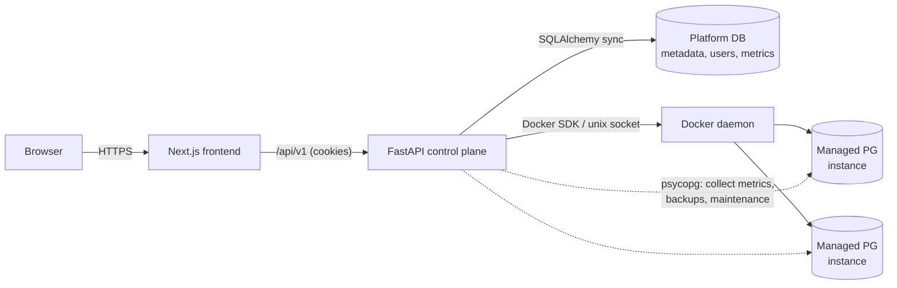
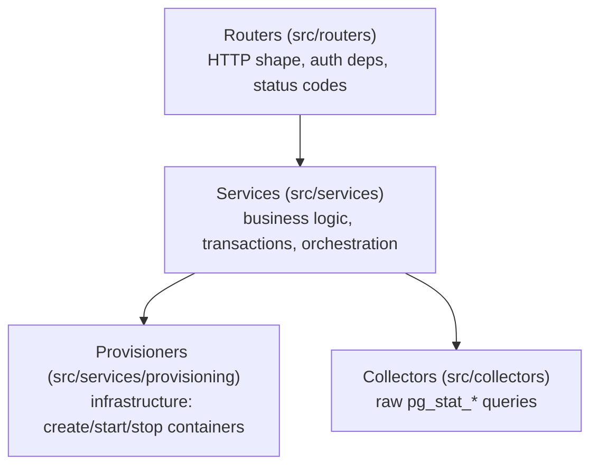
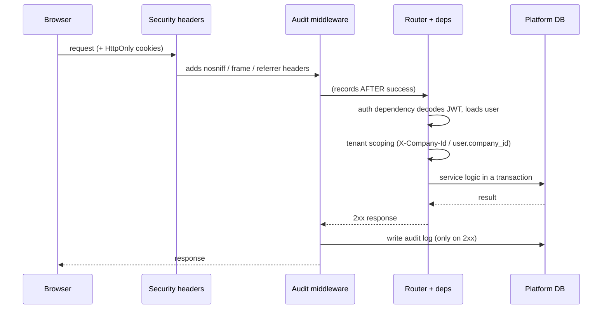
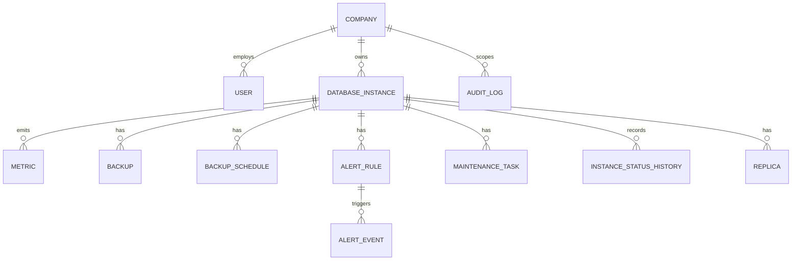
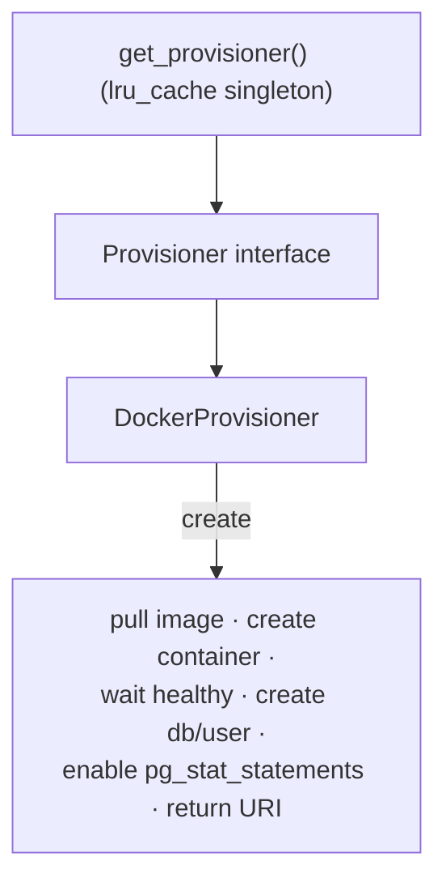

# Architecture

This document explains **how the platform is built and why** — the moving parts,
the boundaries between them, and the design decisions behind them. For *what* the
product does and how to run it, see the [README](README.md).

- **Backend** — Python 3.12 · FastAPI · SQLAlchemy 2 (sync) · Alembic · PostgreSQL 16
- **Frontend** — Next.js (App Router) · TypeScript · Tailwind · next-intl
- **Runtime** — Docker Compose; instances are provisioned as **real PostgreSQL containers**

---

## 1. System context

The control plane (this app) manages a fleet of managed PostgreSQL databases. The
browser talks only to the frontend and the API; the API is the only component that
talks to the Docker daemon and to the managed databases.



The distinction that matters: **the platform database** (one Postgres holding all
control-plane metadata — users, instances, metrics, backups, audit) is separate
from the **managed databases** (the containers the platform creates). The API
connects to managed databases only to do work on them (collect stats, run
`pg_dump`, `VACUUM`, etc.); their connection URIs are stored **encrypted** in the
platform DB.

---

## 2. Layered backend

A single, strictly enforced rule keeps the backend legible at ~10k lines:

> **Routers → Services → Provisioners.** A layer may call the layer below it,
> never above, and never skip a layer.



- **Routers** own the HTTP contract: request/response schemas (Pydantic v2),
  dependency-injected auth and tenant scoping, and status codes. They contain no
  business logic.
- **Services** own the logic and the database transaction boundary. They compose
  provisioners, collectors and models; they are what the tests exercise most.
- **Provisioners** own *infrastructure*. The `Provisioner` interface abstracts
  "make a database exist" so the Docker implementation can be swapped for a cloud
  backend without touching services (see §6).

**Why this matters:** the layering is the single most load-bearing decision in the
codebase. It is what lets a reader open any router and know exactly where the logic
lives, and what makes the provisioning backend replaceable.

---

## 3. Request lifecycle

Every request passes through a deliberate middleware chain and a dependency stack:



- **Auth** is a FastAPI dependency: it reads the JWT from an **HttpOnly cookie**
  (not JS-readable), validates it, checks the token blacklist, and yields the
  current `User`. Refresh is a separate rotating-token endpoint.
- **Tenant scoping** resolves the active company (a superuser's `X-Company-Id`
  header, or a regular user's own `company_id`) into a `CompanyScope` that is
  threaded into every query. A mutating route additionally passes through the
  write gate (company admin); see §7.
- **Audit middleware is added last** so it runs innermost — it records an action
  **only after** the handler returns 2xx, mapping method+path to a semantic action
  (`instance_created`, `backup_created`, …) without ever reading the request body.

---

## 4. Background workers

Seven long-running loops are started in the FastAPI **lifespan** and stopped
gracefully on shutdown (each has its own `asyncio.Event`; shutdown sets them all
and awaits the tasks so no DB commit is torn mid-flight):

| Worker | Interval | Responsibility |
|---|---|---|
| Status poller | ~10s | Reconcile container state → `instance_status_history` (drives uptime) |
| Metrics poller | 60s | Collect `pg_stat_*` from each RUNNING instance → `metrics` |
| Alert evaluator | 60s | Evaluate rules against latest metrics; open/resolve events; fire webhook |
| Backup scheduler | 60s | Run due `BackupSchedule`s (cron), apply retention |
| Maintenance scheduler | 60s | Run due `MaintenanceSchedule`s (VACUUM/ANALYZE/…) |
| Replication poller | ~10s | Monitor standby lag |
| Demo workload generator | 15s | Keep the demo fleet alive with a light baseline load (demo mode only, see below) |

Each loop opens its own `SessionLocal()` (outside the HTTP request scope), guards
every instance in a `try/except` so one bad instance doesn't sink the cycle, and
does blocking I/O in `asyncio.to_thread` to keep the event loop free. The Docker
connection itself is a fail-fast at startup: if the daemon is unreachable, the app
refuses to boot rather than failing on the first provisioning request.

### The always-live demo fleet (demo mode)

The platform's job is to manage database instances — but a fresh fleet of empty
databases for fictional companies has nothing to monitor. So in demo mode the
fleet is **generated on purpose and alive from the first login**, and the UI is
explicit about it (a persistent notice + an *About this demo* page). Two pieces
make it live, both honest about being synthetic:

**Seeded history (boot).** After provisioning, `seed/demo._enrich_boot()` takes
one real measurement per instance and then calls `seed/history.enrich_fleet()` to
write what can't happen live in a five-minute visit: 24h of metrics, a 30-day
uptime KPI (backdated `created_at` + `instance_status_history`), ~2 weeks of
backups, alert timelines and maintenance history. It is idempotent, so restarting
the stack never duplicates it. (A subtlety worth noting: provisioning writes
`pending/provisioning/running` status rows, so `_enrich_boot` clears them first —
otherwise the uptime backdate would be skipped and the KPI would measure a
seconds-long window.)

**Baseline load (continuous).** `services/workload_simulator.py` keeps a light,
continuous load flowing so the *live* numbers — connections, throughput, latency,
slow queries, disk growth — always have real signal. It has no external state: it
runs every cycle at `BASELINE_INTENSITY` and only ever touches demo instances.

- **Connection curve.** Each instance holds an open pool whose size follows a 24h
  cosine (afternoon peak, night trough, dampened on weekends), phase-shifted per
  instance so the fleet doesn't breathe in unison, scaled by `BASELINE_INTENSITY`.
  Production runs the full range up to `DEMO_WORKLOAD_MAX_CONNECTIONS`; staging
  about half. The curve is pure and deterministic (unit-testable), and the boot
  backfill reuses the *same* function at the *same* intensity — so the 24h history
  meets the live baseline with no step at "now".
- **Query mix.** Every cycle part of the pool runs an OLTP-shaped mix: ~55% point
  reads and ~20% aggregates over the seeded dataset, ~20% writes, and an occasional
  deliberately expensive self-join over a ballast table — the one that gives the
  slow-query screen something real to investigate.
- **Blast radius & labelling.** Only instances marked demo (`notes == DEMO_MARKER`),
  RUNNING and provisioned are touched; instances you create are never driven.
  Writes are confined to a `workload_events` table the generator creates itself,
  pruned to ~2k rows so the size graph doesn't ramp forever. Connections carry
  `application_name='dbaas-demo-workload'`, so the synthetic traffic is identifiable
  in the active-connections screen, never disguised as users.
- **Off switch.** `DEMO_MODE=false` — the workload loop doesn't start and the seed
  doesn't enrich; the UI's demo notice (a build-time `NEXT_PUBLIC_DEMO_MODE` flag)
  disappears too.

**Design note — the road here (why there's no "Simulate usage" button).** An
earlier iteration kept the fleet *empty* on boot for honesty and gated everything
behind a **Simulate usage** button: one click ran a ~90-second scripted "reel" —
a director (`demo_simulation.py`) drove traffic up, created an alert from a
measured value, ran a real `pg_dump` and `VACUUM`, then let the alert resolve as
traffic fell. It worked, and it demonstrated that the operations were genuinely
real. But it had costs: the first screen looked switched off until you found and
pressed the button (most visitors never did); the accelerated virtual clock it
used to draw a 24h curve in minutes made the sparklines jump; and stopping it left
the fleet looking dead again. Since a fresh clone is populated on boot anyway, the
reel's unique value had shrunk to "watch it happen live", which most visitors
skip. So it was removed and its intent folded into the product: the fleet is
generated and kept alive from the first second, and the *About this demo* page
keeps that transparent. A monitoring platform should be shown monitoring
something — the honest move was to make that the default, and say so on screen,
rather than hide it behind a button. (Removed with it: the director, the
`demo_simulation` table, the accelerated clock, and the `/demo/simulation/*`
endpoints.)

---

## 5. Data model (core entities)



`DatabaseInstance` is the root of ownership: backups, alerts, maintenance and
replicas all inherit their tenant via the instance's `company_id`. Deletes are
**soft** (`deleted_at`), so history and audit stay intact. Uptime is *derived*,
not stored: `instance_status_history` records every status transition, and the
percentage is computed over a 30-day window (see §8).

---

## 6. Provisioning engine

The `Provisioner` abstraction is the seam that keeps "run a real database" out of
the business logic:



- The interface defines `create / start / stop / delete` in infrastructure terms.
- `DockerProvisioner` implements them against the Docker SDK: it allocates a host
  port, boots a `postgres:16-alpine` container, waits until it accepts
  connections, provisions an app database + least-privilege user, and hands back a
  connection URI (which the service encrypts before persisting).
- `get_provisioner()` is an `@lru_cache` singleton so the daemon connection is
  established once. Swapping Docker for a cloud/k8s backend means one new
  `Provisioner` subclass — services are untouched.

---

## 7. Security model

Defense in depth, appropriate to a control plane that holds database credentials:

- **Auth** — JWT in **HttpOnly, SameSite cookies** (immune to JS/XSS token theft),
  short-lived access + rotating refresh, and a **token blacklist** for real logout.
- **Secrets at rest** — managed-database connection URIs are **Fernet-encrypted**;
  the key is validated at startup and never committed. Placeholders like
  `change-me` are rejected on boot.
- **Account recovery handles** — changing your own email or password requires the
  **current password**. Possession of a 30-minute access token must not convert
  into permanent ownership of the account.
- **Query safety** — the SQL console is **SELECT-only**, enforced by a SQL guard
  before execution; `EXPLAIN ANALYZE` reuses the same guard. Literals and comments
  are blanked before the keyword scan, so `WHERE action = 'create'` is data rather
  than a rejected statement. Behind it sits the real boundary: the per-instance
  role has CRUD on its own database and nothing else.
- **Transport/headers** — rate limiting (slowapi) on auth *and* on SQL execution,
  strict security headers (`nosniff`, `X-Frame-Options: DENY`, referrer policy,
  `no-store`), scoped CORS, `Secure` cookies driven by config rather than by the
  request scheme alone (a TLS-terminating proxy makes the scheme unreliable).
- **Error redaction** — messages persisted to rows the API returns
  (`Backup.error_message`, `MaintenanceTask.result_summary`) are stripped of host,
  port, IP, URI and path before storage; the unredacted text goes only to the log.
  Otherwise one endpoint hands back what another deliberately withholds.
- **Auditability** — every successful mutation is recorded with the real actor.

### Authorization: scope and gate

Two questions, answered in two different places, and neither substitutes for the
other.

**Scope — *which rows?*** `core/scoping.py` resolves a `CompanyScope` and every
read path applies it. Three cases, deliberately not two: a superuser with no
workspace selected sees everything; anyone with a company sees that company; a
regular user with **no** company sees **nothing**. Modelling this as a bare
`Optional[UUID]` forces `None` to mean both "unrestricted" and "no company", and
every consumer that reads it as the first hands a company-less account the
unassigned instances and the platform-wide dashboard, alerts and audit trail. The
type makes the wrong reading unspellable.

**Gate — *read or write?*** `get_current_company_admin` states the rule once:
**members observe, admins operate**. Everything that mutates depends on it;
everything read-only — including the SELECT-only console — depends on
`get_current_user`. The line is drawn at "does it mutate?" rather than by
per-endpoint judgement, because an exceptions list rots as endpoints are added.

The two compose: passing the gate grants no reach. An admin of another company
gets `404` (not `403`, which would confirm the resource exists) because the
scoping layer still runs. The frontend's `useCanManage()` mirrors the gate to
decide what to render — that is cosmetics; the dependency is the boundary.

---

## 8. Observability

The platform is its own monitoring system. Metrics come from **real `pg_stat_*`
queries** (not synthesised): connections, cache-hit ratio, database size,
transaction counters and P95 latency (via `pg_stat_statements`). Fleet KPIs are
derived on read:

- **Queries/sec** — delta of the cumulative `xact_commit` counter between the two
  most recent samples (negative deltas from a counter reset are discarded).
- **P95 latency** — mean of each RUNNING instance's latest `p95_query_latency_ms`.
- **30-day uptime** — computed from `instance_status_history`: the fraction of the
  window spent `RUNNING`, with carry-in for windows that start mid-state.

Metrics have a 30-day retention sweep to bound table growth.


**Chart resolution is server-side.** `GET /instances/{id}/metrics/history`
resamples the window into at most `points` buckets (default 120) and returns the
**average per bucket**. Without it, a 24h window at the raw cadence would ship
thousands of points to draw a 250px sparkline, and the seeded 24h history (5-min
steps) would not blend cleanly with the live 60s samples. The card sparklines ask
for 48 buckets; full-page charts use the default.

---

## 9. Backup & recovery

Two independent dimensions, modelled separately (`backup_type` = who started it;
`strategy` = how):

- **Logical** — `pg_dump`, portable, per-database.
- **Physical** — `pg_basebackup`, the basis for point-in-time recovery.

Schedules are cron expressions (`croniter`) with a retention policy; the scheduler
computes `next_run_at`, runs due jobs, and prunes expired files. Backup rows are
kept even after the file is deleted (`status = DELETED`) so the history is a real
audit trail.

---

## 10. Frontend

Next.js App Router with a small, single-responsibility component style:

- **Data layer** — a generic `useResource` hook collapses the fetch/loading/error
  boilerplate; feature hooks (`useInstances`, `useAlerts`, …) own their API surface
  and optimistic local updates. A single `lib/api.ts` wraps `fetch` with cookie
  credentials, a **401 → refresh → retry-once** flow, and error normalisation.
- **Providers** — Theme (light/dark), Auth, Toast and Confirm wrap the tree; the
  dashboard layout mounts a global **⌘K/Ctrl+K command palette**.
- **i18n** — next-intl, English default + Portuguese, locale in a cookie (no
  `/[locale]/` in URLs). Message parity/order/ICU are **enforced in CI**.
- **Loading** — skeletons mirror the KPI row and card grid so layouts don't reflow.

---

## 11. Key design decisions

| Decision | Why |
|---|---|
| **Sync SQLAlchemy**, not async | The workload is provisioning/orchestration-bound, not connection-count-bound; sync sessions are simpler to reason about and to test. Blocking I/O is offloaded to threads in the async workers. |
| **Strict Routers → Services → Provisioners** | Predictable code location and a replaceable infrastructure backend (see §6). |
| **`Provisioner` interface over Docker** | Isolates "real database" concerns; a cloud/k8s backend is a new subclass, not a rewrite. |
| **Uptime derived from status history**, not a stored number | A single mutable column can't answer "uptime over the last 30 days"; an append-only history can, and it doubles as an audit trail. |
| **HttpOnly-cookie auth** over localStorage tokens | Tokens are unreadable to JS, closing the XSS token-theft vector; the SPA never handles the token directly. |
| **Encrypted connection URIs** | The platform DB holds credentials to every managed database — they must not be readable at rest. |
| **Audit in middleware, post-2xx** | Central, tamper-consistent recording without every handler re-implementing it, and without logging failed attempts as if they happened. |

---

## 12. Testing & CI

- **Backend** — pytest against a **real PostgreSQL** (service container in CI, not
  mocks), 272 tests at 82% coverage, plus ruff lint.
- **Frontend** — ESLint + `tsc` typecheck + production build, plus the i18n parity
  check, all in CI.
- **End-to-end** — Playwright smoke tests over the critical path (login → dashboard
  → navigation → command palette → instance detail); see [`frontend/e2e`](frontend/e2e).
- **CI** runs three jobs in parallel on every push/PR: backend, frontend, and a
  backend Docker image build.

---

## 13. Deployment topology

`docker-compose` wires four services: `postgres` (platform DB), `backend`
(FastAPI + the six workers, mounting the Docker socket to provision instances),
`frontend` (Next.js standalone production image), and `pgadmin` (DB inspection).
The backend needs the Docker socket and matching host UID/GID to write backup
files; the frontend is a baked production image, so frontend changes require an
image rebuild.
```
