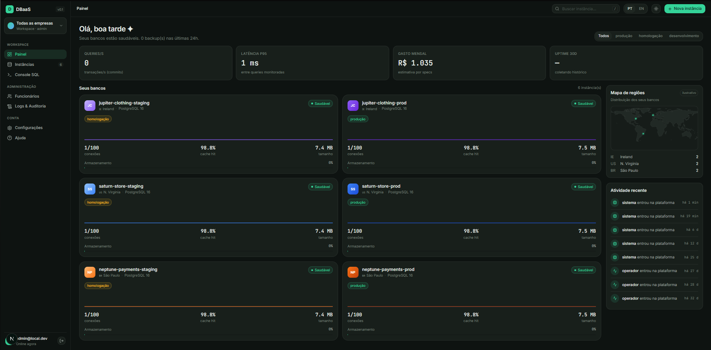
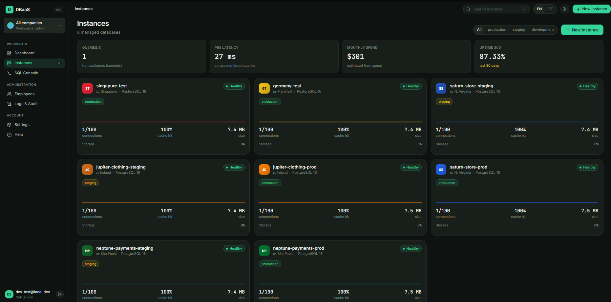
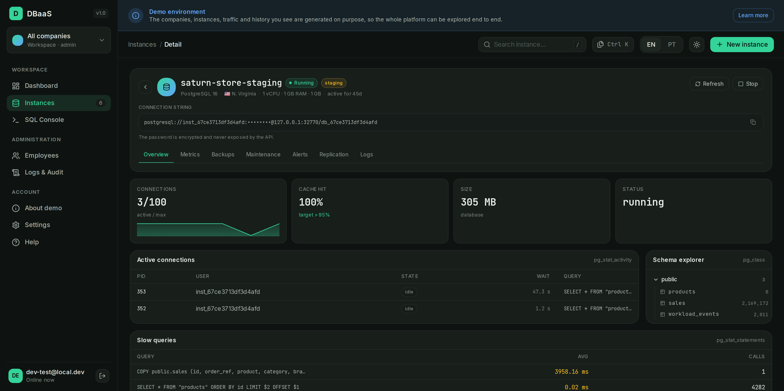
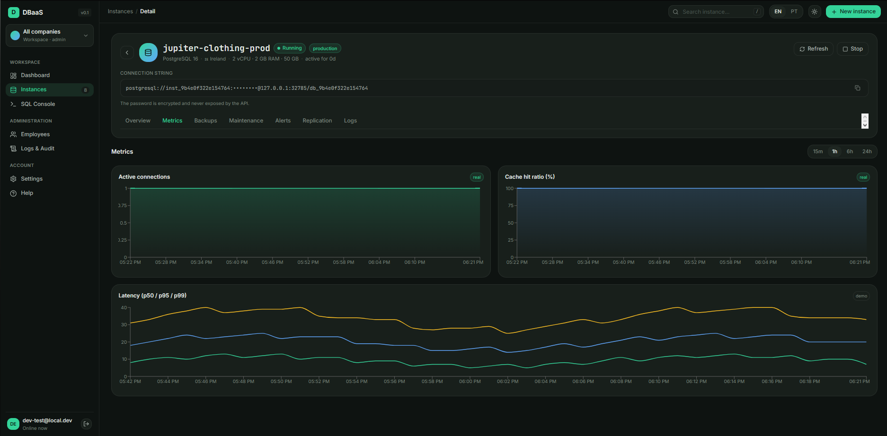
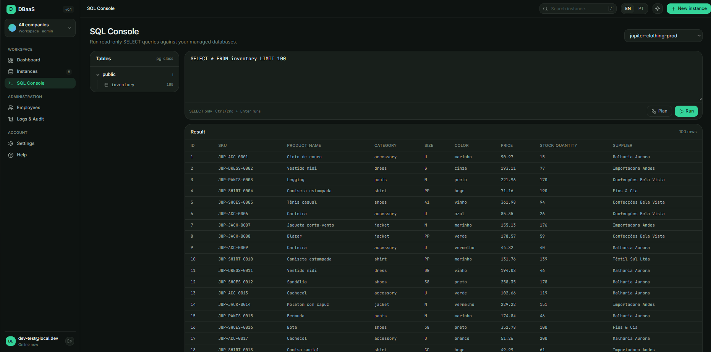
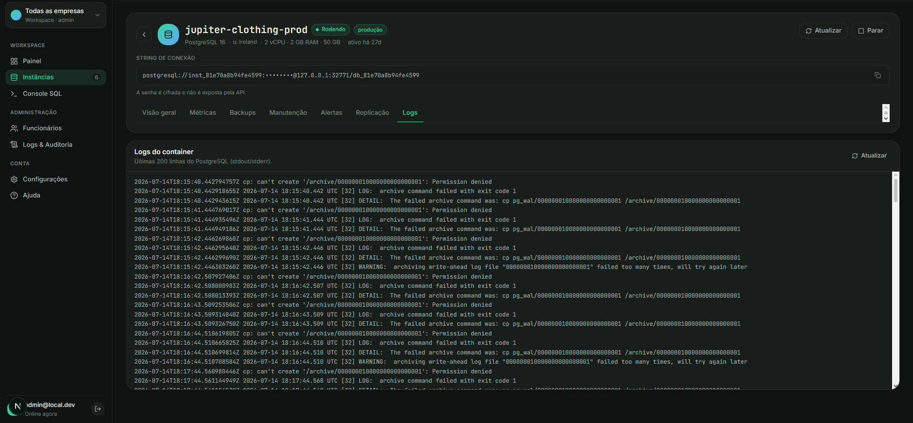
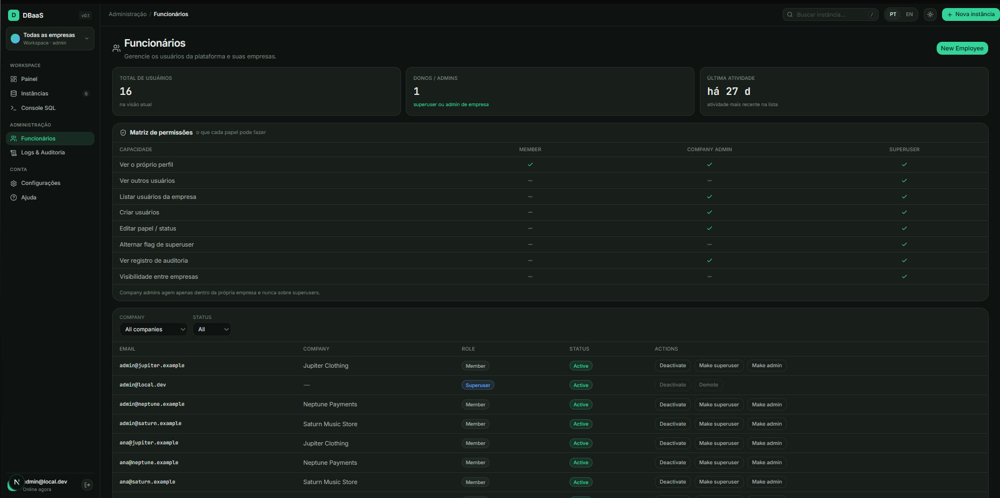

# Database as a Service Platform

Full-stack platform for provisioning, managing, monitoring, and maintaining PostgreSQL database instances. Combines a FastAPI backend with a Next.js frontend for end-to-end database lifecycle management.

This DBaaS was designed as a long-term engineering project focused on infrastructure automation, database lifecycle management, observability, security hardening, and operational reliability.

The project simulates real-world DBaaS concepts commonly found in modern platform engineering and cloud database services.


[](https://github.com/Luis-Mussalem/dbaas-platform/actions/workflows/ci.yml)


---

> **Note**
>
> This public repository contains a sanitized and simplified version of the platform.
>
> Sensitive infrastructure details, production credentials, operational environments, and client-specific configurations were intentionally excluded for security reasons.
>
> The repository preserves the core architecture, engineering concepts, and implementation patterns of the platform for portfolio purposes.

---

# Overview

Modern applications increasingly depend on scalable and automated infrastructure services.

This project explores how database infrastructure can be abstracted into a full-stack platform capable of:

- Provisioning PostgreSQL instances dynamically
- Managing database lifecycle and state transitions
- Monitoring health and performance metrics
- Performing automated maintenance routines
- Handling backups and recovery workflows
- Applying practical security hardening techniques
- Structuring infrastructure operations through APIs
- Exposing all of the above through a modern web interface

The goal is not only to build APIs, but to design systems that simulate operational challenges found in real backend and infrastructure environments.

## Project at a Glance

| | |
|---|---|
| **API surface** | 64 REST endpoints across 13 domain routers (`/api/v1`) |
| **Codebase** | ~24,000 lines — 10,100 backend (Python) · 5,000 tests · 9,000 frontend (TypeScript) |
| **Test suite** | 314 backend tests (82% coverage) + 13 Playwright E2E smoke tests |
| **Data layer** | 17 Alembic migrations, 15 SQLAlchemy models |
| **Frontend** | 11 routes, 39 reusable React components, fully typed API client |
| **Background automation** | 8 concurrent loops — status, metrics, alerts, backups, maintenance, replication lag, demo simulation director, workload generator |
| **Delivery** | 3-job CI pipeline + one-command full-stack Docker Compose |

## Demo Login

A ready-to-use demo account lets you explore the whole platform hands-on — browse
the fleet across all tenants, provision new instances, stop and delete them, run
the SQL console, inspect metrics, backups and replication. It is a full-access
account so recruiters can try every feature end to end.

| | |
|---|---|
| **Email** | `dev-test@local.dev` |
| **Password** | `dev-test-2026` |

The account is seeded automatically by the database migrations. Since the project
runs locally with fictional seed data, each person works against their own copy —
so exploring freely (including destructive actions) is safe and expected.

### A demo fleet is already there — and it is real

On the first `docker compose up`, the backend seeds a fictional multi-tenant
**fleet**: 3 companies, each with a `prod` and a `staging` instance across three
regions, plus ~100 rows of mock data in each production database. When Docker is
available these are **real PostgreSQL containers** provisioned by the platform
itself, so the SQL console, live logs and metrics work end to end; on Docker
Desktop for macOS/Windows the seed falls back to data-only records. The seed is
idempotent — restarting the stack never duplicates it — and runs in the
background, so the fleet may take a minute to appear on a fresh boot.

What the seed does **not** do is invent history. On a clean clone the fleet is
minutes old: alerts, backups and maintenance screens are honestly empty, and the
charts are as shallow as a brand-new database deserves. Everything you see was
measured.

### Press "Simulate usage" to watch it work

A monitoring product with an idle fleet looks broken — and a dashboard full of
fabricated numbers is worse. So the fabrication is opt-in: the **Simulate usage**
button (top bar, or `/demo`) runs a **~90 second** script in which the platform
administers the fleet for real:

| Step | What actually happens |
|---|---|
| Seed the history | The one honest exception: 30-day uptime and weeks of backups can't happen live, so they are seeded — and flagged |
| Traffic ramps up | Connection pools open across the fleet and run an OLTP query mix, on a daily curve compressed to run 144× faster |
| An alert fires | A rule is set just under the connection ratio *measured at that moment*; the evaluator opens the event on its own |
| Back up production | `pg_dump` runs against each production database — real `.dump` files land in `data/backups/` |
| Run maintenance | Real `VACUUM` and `ANALYZE`, recorded as maintenance tasks |
| Load recovers | Traffic drops, and the evaluator resolves the open alert from the metrics it reads |

While any simulated data exists, a banner says so on every screen, and one click
clears it — deleting the seeded history along with the artifacts the run
produced, and restoring the fleet to its real state. The traffic generator only
ever touches the demo fleet (instances you create are never driven), confines its
writes to a `workload_events` table it creates, and identifies its connections as
`dbaas-demo-workload` in the active-connections screen.

`DEMO_MODE=false` removes the endpoints and the button entirely;
`DEMO_WORKLOAD_MAX_CONNECTIONS` lowers the load on a modest machine. Design notes
in [ARCHITECTURE.md](ARCHITECTURE.md#4-background-workers).

To explore the per-company view and RBAC, log in as any seeded company user
(each company has 1 admin + 4 members) — they see only their own company, while
the `dev-test@local.dev` superuser above sees and switches between all:

| Company | Users | Password |
|---|---|---|
| Neptune Payments | `admin@neptune.example`, `ana@neptune.example`, … | `DemoPass123!` |
| Saturn Music Store | `admin@saturn.example`, `ana@saturn.example`, … | `DemoPass123!` |
| Jupiter Clothing | `admin@jupiter.example`, `ana@jupiter.example`, … | `DemoPass123!` |

(Members: `ana`, `bruno`, `carla`, `diego` at each company's domain.)

## Table of Contents

- [Screenshots](#screenshots)
- [Core Engineering Concepts](#core-engineering-concepts)
- [Tech Stack](#tech-stack)
- [Features](#features)
- [Internationalization](#internationalization)
- [Architecture](#architecture)
- [Provisioning Workflow](#provisioning-workflow)
- [Security Approach](#security-approach)
- [Observability](#observability)
- [Backup & Recovery Strategy](#backup--recovery-strategy)
- [Testing & Quality Assurance](#testing--quality-assurance)
- [Running the Project](#running-the-project)
- [Current Development Status](#current-development-status)

---

# Screenshots

> The dashboard is a Next.js 16 App Router frontend (TypeScript, Tailwind v4).
> The UI ships in English and Portuguese — these captures are in English; the
> language toggle is in the top bar.
> Data shown is collected from real provisioned PostgreSQL containers with seeded
> datasets — the only exception is the per-query latency chart, labelled *demo*
> in the UI itself (the backend collects fleet-wide P95, not per-execution latency).



**Fleet dashboard** — real-time fleet KPIs (queries/s, P95 latency, 30-day uptime),
a region map of where the databases run, per-company health cards and a live
activity feed of who did what.

<table>
  <tr>
    <td width="50%" valign="top">
      <br>
      <b>Instances</b> — the managed fleet with production / staging / development filters; each card shows region, engine version, health, connections, cache-hit ratio, size and storage.
    </td>
    <td width="50%" valign="top">
      <br>
      <b>Instance overview</b> — connection string (password encrypted, never exposed by the API), health tiles, live connections (<code>pg_stat_activity</code>), schema explorer (<code>pg_class</code>) and slow queries (<code>pg_stat_statements</code>).
    </td>
  </tr>
  <tr>
    <td width="50%" valign="top">
      <br>
      <b>Instance metrics</b> — time-series for active connections and cache-hit ratio (live) plus p50 / p95 / p99 latency (demo), with a 15m / 1h / 6h / 24h window selector.
    </td>
    <td width="50%" valign="top">
      <br>
      <b>SQL console</b> — read-only SELECT runner against a managed database, with a schema browser, results grid and <code>EXPLAIN</code> plans (Ctrl/Cmd + Enter to run).
    </td>
  </tr>
  <tr>
    <td width="50%" valign="top">
      <br>
      <b>Logs &amp; audit</b> — an immutable, filterable trail of platform actions (logins, instance created / deleted / status changed) with resource, source IP and time.
    </td>
    <td width="50%" valign="top">
      <br>
      <b>Multi-tenancy &amp; RBAC</b> — the employee directory with a role capability matrix (Member / Company Admin / Superuser) and per-company user management.
    </td>
  </tr>
</table>

---

# Core Engineering Concepts

This project focuses heavily on backend engineering and operational concepts, including:

- Modular backend architecture
- Infrastructure abstraction layers
- Stateful resource management
- Database provisioning workflows
- Security hardening and defense-in-depth
- PostgreSQL observability
- Automated maintenance operations
- Backup and recovery strategies
- API-first platform design
- Reproducible containerized environments
- Full-stack integration with a typed React frontend

---

# Tech Stack

## Backend
- Python 3.12
- FastAPI 0.115

## Database
- PostgreSQL 16
- SQLAlchemy 2.0 (sync)
- Alembic
- psycopg

## Infrastructure
- Docker
- Docker SDK for Python

## Security
- JWT Authentication
- bcrypt
- cryptography (Fernet encryption)
- SlowAPI (rate limiting)

## Validation & Configuration
- Pydantic v2
- pydantic-settings
- python-dotenv

## Scheduling & Automation
- croniter

## Frontend
- Next.js 16 (App Router)
- TypeScript
- React 19
- Tailwind CSS v4
- shadcn/ui + Base UI
- recharts (metrics visualization)
- lucide-react (icons)
- next-intl (i18n — English/Portuguese)

---

# Features

## Authentication & Security
- JWT access and refresh tokens
- Token revocation (blacklist)
- Timing-safe authentication flow
- Strong password validation
- Rate limiting on authentication endpoints
- Security headers middleware
- Restricted registration flow
- Encrypted connection URIs using Fernet

---

## Database Instance Management
- PostgreSQL instance provisioning via API
- Stateful lifecycle management
- Status transition validation
- Resource isolation
- CPU and memory limits
- Soft delete strategy

---

## Provisioning Engine
- Abstract provisioning interface
- Docker-based PostgreSQL provisioning
- Dedicated database roles per instance
- Secure connection string generation
- Health polling and status verification
- Self-healing across Docker restarts (`unless-stopped` containers + automatic reconciliation of instance status on startup)

---

## Monitoring & Observability
- PostgreSQL statistics collectors (`pg_stat_*`)
- Health checks per instance
- Query performance monitoring
- Slow query analysis
- Lock monitoring and deadlock inspection
- Index usage analysis
- Table bloat estimation
- `EXPLAIN ANALYZE` capture workflows
- Metrics retention policies
- Fleet KPIs on the dashboard — throughput (transactions/s), P95 query latency
  (`pg_stat_statements`), and 30-day uptime derived from a status-history table

---

## Backup & Recovery
- Logical backups (`pg_dump`)
- Physical backups (`pg_basebackup`)
- WAL archiving
- Point-in-Time Recovery (PITR)
- Scheduled backups
- Automatic retention cleanup
- Restore workflows

---

## Automated Operations
- Maintenance schedulers
- Metrics polling
- Backup scheduling
- Expired token cleanup
- Health monitoring tasks

---

## Alerts & Notifications
- Configurable alert rules per instance (threshold, condition, severity)
- Automated evaluation against collected metrics (60-second cycle)
- Auto-fire and auto-resolution of alert events
- Severity levels: info, warning, critical
- Default rule seed (connections, cache hit ratio, disk usage, long queries, backup age)
- HTTP webhook integration for external notification delivery

---

## Replication & High Availability
- Streaming physical replicas provisioned from a primary via `pg_basebackup` (`-R`, hot standby)
- Each standby joins the fleet as a first-class instance (own status, port, metrics)
- Continuous lag monitoring on the primary (`pg_stat_replication`) — bytes and seconds behind, refreshed every 30 s
- Manual failover: promote a standby to standalone primary (`pg_promote`) via `POST /replicas/{id}/promote`
- Company-scoped like every other resource (a replica of another company's instance is a 404)

---

## Administration & Audit
- Platform dashboard with consolidated health view across all instances
- Audit log with automatic event capture via middleware (no manual annotation)
- 11 audited action types across auth, instances, backups, and maintenance
- Filterable audit trail by action type, resource type, and user

---

## Multi-Tenancy
- Company model with per-company resource scoping — regular users see only their company's instances
- Superuser active-company switcher: `WorkspaceSwitcher` writes the selected company to `X-Company-Id` header, backend filters accordingly
- All derived resources (backups, alerts, metrics, maintenance) inherit scoping via the instance choke-point
- Employee management — company-scoped user CRUD (create, edit, deactivate)
- Company-admin RBAC: two orthogonal axes — platform `is_superuser` × intra-company `admin`/`member` role; company admins manage their own company, with a guard against removing the last active admin
- Per-company audit scoping — each company sees only its own audit trail
- Superuser bypasses the filter and sees all companies simultaneously

---

## Frontend Interface
- JWT authentication with token rotation (login, logout, protected routes)
- Instance list with status badges and resource summary
- Instance detail with tabbed views (overview, metrics, backups, maintenance, alerts, replication, logs)
- Start / Stop / Delete actions with reactive status updates
- Time-series metric charts (cache hit ratio, connections) with 15m/1h/6h/24h window selector
- Live monitoring: slow queries and active locks
- Backups management — list, create, restore and scheduling
- Maintenance actions and alert rules/events management
- Replication tab — create standbys, watch live lag, promote to primary
- Container logs viewer — live PostgreSQL stdout/stderr per instance
- SQL console — read-only query runner with schema browser, results grid and `EXPLAIN` plans
- Consolidated dashboard and audit log
- Workspace switcher — active-company selection propagated to every API call
- Redesigned dark UI: collapsible sidebar, world-map region picker, light/dark themes
- Bilingual UI (English/Portuguese) — see [Internationalization](#internationalization)

---

# Internationalization

The UI ships in **English (default) and Portuguese**, via
[next-intl](https://next-intl.dev). Four decisions are worth calling out:

**No locale in the URL.** There are no `/[locale]/` segments, so the `app/`
tree stays flat. The active locale lives in an `HttpOnly` `NEXT_LOCALE` cookie,
written by a Server Action and read in `i18n/request.ts`. A cookie rather than
`localStorage` because the server needs the locale to render `<html lang>` — the
opposite trade-off from the theme, which is a class the client applies to the DOM.
A tampered cookie falls back to English instead of throwing.

**Full sentences per branch, never concatenation.** Gender, number and participle
agreement don't survive string-joining. A backup toast is one ICU `select` whose
branches each carry the whole sentence, so a translator controls the grammar:

```jsonc
"created": "{strategy, select, logical {Logical backup created.} physical {Physical backup created.} other {Backup created.}}"
```

Plural rules follow the CLDR per language — Portuguese uses the `one` branch for
zero ("0 alerta ativo"), English uses `other` ("0 active alerts").

**Prices are per-currency tables, not FX conversion.** `lib/cost.ts` holds
independent BRL and USD rate cards, the way AWS and GCP publish regional pricing.
The ratio between the two totals is deliberately *not* an exchange rate.

**Drift fails the build.** `en.json` is the source of the `Messages` type
(`global.d.ts`), so an unknown key is a `tsc` error. `npm run i18n:check` runs in
CI ahead of the typecheck and parses both files with a real ICU parser to compare
placeholders, `select` branches and rich-text tags — a regex can't do this, since
it reads the text inside a `plural` branch as if it were a placeholder.

Region names, city names and technical vocabulary (`VACUUM`, `WAL`, `p95`) are
deliberately left untranslated — AWS doesn't rename `sa-east-1` per language.
Error `detail` strings from the API stay English in both locales; translating them
would need the backend to return structured codes, which is a project of its own.

---

# Architecture

The project is organized as a monorepo separating backend, frontend, and data layers.

> 📐 **Deep dive:** [`ARCHITECTURE.md`](ARCHITECTURE.md) documents the layered
> design, request lifecycle, the six background workers, the provisioning engine
> and the key design decisions — with diagrams.

```text
dbaas-platform/
│
├── backend/                  # Python / FastAPI control plane
│   ├── src/
│   │   ├── collectors/       # PostgreSQL metrics & statistics collectors (pg_stat_*)
│   │   ├── core/             # Config, security, encryption, scoping, SQL guard, audit middleware
│   │   ├── models/           # SQLAlchemy ORM models (instances, backups, alerts, replicas, …)
│   │   ├── routers/          # 14 API routers — 60 REST endpoints under /api/v1
│   │   ├── schemas/          # Pydantic v2 request/response schemas
│   │   ├── services/         # Business logic, background pollers & schedulers
│   │   │   └── provisioning/ # Provisioner interface + Docker implementation
│   │   └── main.py           # FastAPI application entrypoint (lifespan tasks)
│   ├── alembic/              # 15 database migrations
│   ├── tests/                # 272 tests (~5,000 lines)
│   └── Dockerfile            # Multi-stage, non-root runtime image
│
├── frontend/                 # Next.js 16 dashboard (TypeScript, App Router)
│   ├── app/
│   │   ├── (dashboard)/      # Authenticated shell: sidebar, topbar, workspace switcher
│   │   │   ├── page.tsx      #   Fleet dashboard (KPIs, region map, health)
│   │   │   ├── instances/    #   Instance list, creation, and tabbed detail views
│   │   │   ├── sql/          #   SQL console (schema browser, results grid, EXPLAIN)
│   │   │   ├── admin/users/  #   Employee management & RBAC matrix
│   │   │   └── audit/        #   Audit trail
│   │   └── login/            # Login page
│   ├── components/           # 37 reusable UI components (+ command palette, skeletons)
│   ├── context/              # React Context (auth, theme, toasts, confirmations)
│   ├── hooks/                # Data hooks — one per API resource
│   ├── i18n/                 # next-intl setup + en/pt parity checker
│   ├── lib/                  # Typed API client, shared types, utilities
│   ├── messages/             # UI strings — en.json (source of types) and pt.json
│   ├── proxy.ts              # Route protection (Next 16 renamed `middleware` → `proxy`)
│   └── Dockerfile            # Standalone production image
│
├── data/                     # Runtime backups and WAL archives (gitignored)
│
├── .github/workflows/ci.yml  # CI: backend, frontend and Docker jobs in parallel
├── docker-compose.yaml       # Full stack: PostgreSQL + pgAdmin + backend API + frontend
└── .env.example              # Environment variable template
```

---

# Service-Oriented Design

The platform separates responsibilities into distinct layers:

| Layer | Responsibility |
|---|---|
| Routers | Request handling and API exposure |
| Schemas | Data validation and serialization |
| Services | Business rules and workflows |
| Models | Persistence layer |
| Collectors | Metrics and observability |
| Core | Infrastructure and security |

This separation allows the project to evolve without tightly coupling infrastructure logic to HTTP endpoints.

---

# Provisioning Workflow

The provisioning flow follows a multi-step orchestration process:

```text
API Request
    ↓
Router
    ↓
Service Layer
    ↓
Provisioner Interface
    ↓
Docker Provisioner
    ↓
PostgreSQL Container
    ↓
Health Polling & Status Update
```

Each database instance behaves as a managed infrastructure resource with its own lifecycle and operational state.

---

# Security Approach

Security was treated as a first-class concern throughout the project.

The platform applies a defense-in-depth strategy combining multiple layers of protection:

- JWT validation
- Token revocation
- Rate limiting
- Strong password policies
- Encrypted connection strings
- Security headers
- Restricted registration flow
- Timing-safe authentication
- Docker networking restrictions
- CORS hardening

The objective is to simulate realistic backend security practices beyond basic authentication flows.

---

# Observability

The monitoring layer goes beyond superficial health checks.

The platform interacts directly with PostgreSQL internal statistics views to inspect database behavior in depth.

Examples include:

- Active connections
- Transaction throughput
- Cache hit ratio
- Lock analysis
- Slow queries
- Query execution plans
- Index usage efficiency
- Table/index bloat estimation

This allows the platform to simulate operational monitoring scenarios commonly found in production database environments.

---

# Backup & Recovery Strategy

The platform implements two complementary backup approaches.

## Logical Backups

Using:
- `pg_dump`
- `pg_restore`

Focused on:
- Portability
- Selective restores
- Version compatibility

---

## Physical Backups & PITR

Using:
- WAL archiving
- Physical backup workflows

Focused on:
- Disaster recovery
- Point-in-Time Recovery
- Continuous recovery workflows

This mirrors backup strategies used in real PostgreSQL production environments.

---

# Testing & Quality Assurance

Quality is enforced automatically on every push and pull request.

## Automated Test Suite
- **272 backend tests** with **82% coverage** (`pytest` + `pytest-cov`)
- Isolated PostgreSQL test database (`dbaas_test`, created by the test suite) —
  never touches development data
- External dependencies are faked, not invoked: Docker SDK, `subprocess`
  (`pg_dump` / `pg_restore` / `pg_basebackup`) and live `psycopg` connections
  are mocked, so the suite runs **without Docker and without any managed
  (client) database** — only a local PostgreSQL for the metadata test DB
- Coverage spans the business-critical layers: instance state machine, alert
  evaluation engine, backup orchestration, maintenance executors, the
  provisioner, and all background pollers/schedulers

## End-to-End Tests
- **9 Playwright smoke tests** over the critical path a recruiter actually clicks:
  login → dashboard → sidebar navigation → **⌘K/Ctrl+K command palette** →
  instance detail
- Read-only (no create/delete), run against the live stack; a `storageState`
  setup logs in once and the specs reuse the session — see
  [`frontend/e2e`](frontend/e2e)

## Continuous Integration
GitHub Actions ([`.github/workflows/ci.yml`](.github/workflows/ci.yml)) runs three jobs in parallel:

| Job | What it does |
|---|---|
| **Backend** | `ruff` lint + `pytest` against a PostgreSQL 16 service container |
| **Frontend** | `i18n:check` (en/pt parity) + `eslint` + `tsc --noEmit` + `next build` |
| **Docker** | Builds the multi-stage backend image (validates the Dockerfile) |

## Containerization
- Multi-stage [`Dockerfile`](backend/Dockerfile): isolated build stage, lean runtime
- Runs as a **non-root** user (defense in depth)
- Ships `postgresql-client-16` so backup/restore work in-container
- Base pinned to `python:3.12-slim-bookworm` for reproducible builds

---

# Engineering Challenges & Lessons Learned

Throughout development, several operational and architectural issues were intentionally documented and resolved.

Examples include:

- Authentication edge cases
- Bcrypt compatibility issues
- Environment variable parsing failures
- Query sanitization vulnerabilities
- Metrics retention growth problems
- Token lifecycle cleanup
- URL encoding edge cases
- Docker networking restrictions

## Case study — the WAL archive that silently never ran

A representative example of the class of bug this project exists to teach.

**Symptom.** The container-logs view of a healthy, RUNNING instance was a wall of
`cp: can't create '/archive/…': Permission denied`, once per second.

**Root cause.** The provisioner creates the WAL archive directory on the host and
bind-mounts it as `/archive`. A bind mount carries the host's ownership into the
container, but the process writing to it is PostgreSQL *inside* the container —
uid 70 in the Alpine image, an id that has no meaning on the host and never matches
the directory's owner. `mkdir` applied the default umask (0755), so uid 70 had read
and execute but no write, and every `archive_command` failed.

**Why it mattered more than the log noise.** PostgreSQL will not recycle a WAL
segment it has not successfully archived. With `archive_mode=on` and an archive
command that always fails, `pg_wal` grows without bound until the disk fills — and
Point-in-Time Recovery, a headline feature, had no segments to replay from.

**Why the tests were green.** The suite fakes the Docker SDK and `subprocess` on
purpose, so it runs without Docker. Nothing ever executed the real `cp`. The defect
lived in the gap between a mocked boundary and the real one — visible only by reading
the logs of an actual container.

**Fix.** An explicit `chmod` on the archive directory at provision time, plus a
regression test asserting the mode bits and the mount, so the silent failure cannot
return. Verified end-to-end against real containers: a freshly provisioned instance
now reports `archived_count > 0` and `failed_count = 0` in `pg_stat_archiver`.

**Lesson.** Mocks verify the code you wrote; only real infrastructure verifies the
assumptions you made. A green suite and a healthy status endpoint both agreed the
instance was fine while its disaster-recovery path had never once worked.

The project maintains an internal engineering log documenting:
- root causes
- debugging process
- mitigation strategies
- architectural decisions

The goal is to reinforce operational thinking and long-term maintainability.

---

# Development Approach

This project follows an engineering-first and learning-oriented development workflow.

Claude Code assisted development tools were used primarily for:

- architecture planning
- technical research
- debugging support
- documentation refinement
- accelerated learning of backend, infrastructure, and frontend concepts

The focus remains on understanding system design decisions, PostgreSQL internals, backend engineering practices, and operational workflows rather than relying on autonomous code generation.

This approach was intentionally adopted to reinforce deep technical understanding while accelerating iteration and experimentation during development.

---

# Running the Project

## Prerequisites

- **Docker Engine + Docker Compose v2** — the whole stack runs in containers.
- **A Linux host** is recommended for full provisioning: the backend uses
  `network_mode: host` and the Docker socket to create and reach sibling
  database containers on the host loopback (see the platform note below).
- Run all commands **from the repo root** (the compose file bind-mounts the
  repo's `data/` directory by absolute path).

---

## Clone the repository

```bash
git clone https://github.com/Luis-Mussalem/dbaas-platform.git
cd dbaas-platform
```

---

## Create environment variables

Copy the template — it ships with working **dev-only** values, so the stack runs
out of the box:

```bash
cp .env.example .env
```

The example covers PostgreSQL, JWT, the Fernet encryption key, Docker
provisioning, pgAdmin and CORS. The bundled secrets protect only fictional local
data — **regenerate them before hosting this anywhere** (each field in
`.env.example` has a one-liner).

Two host-specific values matter for **Option A** (Docker Compose). Their defaults
(`DOCKER_GID=999`, `HOST_UID=1000`, `HOST_GID=1000`) already cover the common
single-user Linux setup — adjust only if yours differs:

- **`DOCKER_GID`** — the backend container joins the host's `docker` group to reach
  `/var/run/docker.sock` (needed to provision sibling containers). Find it with
  `getent group docker` (e.g. `docker:x:999:you` → `DOCKER_GID=999`). A
  `PermissionError` on the Docker socket at startup is almost always this.
- **`HOST_UID` / `HOST_GID`** — the backend runs as your host user so it can write
  backup/WAL files into the bind-mounted `./data`. Find them with `id -u` / `id -g`.

Option B (manual `uvicorn`) needs neither — it already runs as your host user.

---

## Option A — Full stack with Docker Compose

Builds and runs everything (PostgreSQL + pgAdmin + backend API + frontend):

```bash
docker compose up --build
```

- Frontend: `http://localhost:3000`
- API / Swagger: `http://localhost:8001/docs`

The backend runs in `network_mode: host` so the provisioner can reach the
sibling database containers it creates on the host loopback, and mounts the
Docker socket + the repo's `data/` directory (see the comments in
[`docker-compose.yaml`](docker-compose.yaml)). Run the command from the repo root.

> **Platform note.** Full provisioning relies on Linux host networking plus the
> Docker socket, so it works best on a **Linux host**. On Docker Desktop for
> macOS/Windows the dashboard and API run fine, but provisioning managed
> instances on the host loopback is unreliable — use Option B there to explore
> the app, or a Linux VM for the full flow. Option B also sidesteps `DOCKER_GID`
> entirely, since `uvicorn` runs as your host user.

---

## Option B — Run backend & frontend manually (development)

Start only the infrastructure, then run each app with hot reload:

```bash
docker compose up -d postgres pgadmin

# API (from backend/, with the virtualenv active)
source .venv/bin/activate
cd backend
uvicorn src.main:app --reload --port 8001

# Frontend (from frontend/)
cd frontend
npm install
npm run dev
```

The frontend runs at `http://localhost:3000`.

---

## Access the API

Swagger UI:

```
http://localhost:8001/docs
```

ReDoc:

```
http://localhost:8001/redoc
```

Health check:

```
http://localhost:8001/health
```

---

## Run the tests

**Backend** — the suite mocks the Docker SDK (no managed containers are created),
but it does need a PostgreSQL to hold its isolated `dbaas_test` database. Start the
compose Postgres first, then run pytest:

```bash
docker compose up -d postgres     # metadata DB for the tests
cd backend
pip install -r requirements-dev.txt
ruff check src/ tests/            # lint
pytest --cov=src                  # 272 tests + coverage
```

**Frontend** — the same gates CI runs (from `frontend/`):

```bash
npm install
npm run lint && npm run typecheck && npm run i18n:check && npm run build
```

**End-to-end** — Playwright, against the running stack (`docker compose up -d`):

```bash
cd frontend
npx playwright install --with-deps chromium   # first run only (downloads the browser)
npm run test:e2e
```

---

## Build the backend image

```bash
docker build -t dbaas-backend backend/
```

---

# Current Development Status

## Backend — Complete

- Foundation & project structure
- Authentication (JWT, token rotation, revocation)
- Security hardening
- Database instance modeling
- Provisioning engine (Docker-based)
- Monitoring & observability
- Backup & PITR
- Infrastructure scaling groundwork
- Automated maintenance workflows
- Alerting & notifications system
- Administration panel & audit log
- Multi-tenancy (companies, per-company scoping, employee management, company-admin RBAC, audit scoping)
- Streaming replication & high availability (standbys, lag monitoring, manual failover)
- Per-instance container logs endpoint
- Automated testing (272 tests, 82% coverage)
- Continuous integration & full-stack Docker Compose (multi-stage backend + frontend images)

## Frontend — Complete

| Feature | Status |
|---|---|
| Authentication (login, logout, token rotation, protected routes) | ✅ Complete |
| Instance list with status badges | ✅ Complete |
| Instance detail page (dynamic routing) | ✅ Complete |
| Start / Stop / Delete actions | ✅ Complete |
| Slow queries & locks visualization | ✅ Complete |
| Backups management (list, create, restore, schedule) | ✅ Complete |
| Maintenance & alerts interface | ✅ Complete |
| Consolidated dashboard + audit log | ✅ Complete |
| Time-series metric charts (cache hit ratio, connections) | ✅ Complete |
| SQL console (read-only SELECT, schema browser, EXPLAIN, history) | ✅ Complete |
| Replication tab (create standby, live lag, promote) | ✅ Complete |
| Container logs viewer | ✅ Complete |

## Planned Future Phases

- Observability stack integration (Prometheus / Grafana / OpenTelemetry)
- End-to-end tests wired into a dedicated CI job

> **On deployment.** The platform is intentionally **run locally**. It provisions
> real database containers through the host Docker socket — a powerful capability
> that is deliberately *not* exposed to a public deployment, for security reasons.
> Cloning and running it locally (below) is the intended way to explore it.

---

# Future Improvements

Potential future improvements include:

- Real-time monitoring dashboards
- Container orchestration
- Distributed task queues
- Cloud-native deployment
- Observability stack integration (Prometheus / Grafana)

---

# Why This Project Matters

This project was designed to go beyond a traditional CRUD backend application.

The project focuses on:
- backend engineering
- infrastructure workflows
- operational reliability
- observability
- lifecycle management
- security hardening
- PostgreSQL internals
- full-stack product development

It represents an effort to bridge backend development, infrastructure-oriented system design, and modern frontend engineering through a product-oriented approach.

---

# Author

Luis Mussalem

- LinkedIn: https://www.linkedin.com/in/luis-mussalem
- GitHub: https://github.com/Luis-Mussalem
